<h1 align="center">Exercise 1: Design a data warehouse</h1>  

<p align="center">
  
</p>

## Task 1: Design the dimension table MyDimDate  

To design the `MyDimDate` table, it is sufficient to inspect the attributes of [DimDate.csv](./CSV/DimDate.csv).

Hence, it will appear as follows.

| Field Name | Details |
|---|---|
| DateID | Primary Key - Unique identifier for each date |
| Date | Full date from the date field of the original data |
| Year | Year derived from the date field of the original data. Example: 2020 |
| Quarter | Quarter number derived from the date field of the original data. Example: 1, 2, 3, 4 |
| QuarterName | Quarter name derived from the date field of the original data. Example: Q1, Q2, Q3, Q4 |
| Month | Month number derived from the date field of the original data. Example: 1, 2, 3 |
| MonthName | Month name derived from the date field of the original data. Example: January |
| Day | Day derived from the date field of the original data. Example: 23, 24 |
| Weekday | Weekday derived from the date field of the original data. Example: 1, 2, 3, 4, 5, 6, 7. 1 for Sunday, 7 for Saturday |
| WeekdayName | Weekday name derived from the date field of the original data. Example: Sunday, Monday |  

## Task 2: Design the dimension table MyDimWaste  

For MyDimWaste, we can simply add `WasteID` as a primary key, next to the attribute `WasteType`, which is shown in the original table of the exercise. 

| Field Name | Details |
|---|---|
| WasteID | Primary Key - Unique identifier for each waste type |
| WasteType | Type of waste. Example: Dry, Electronic, Plastic, Wet |

## Task 3: Design the dimension table MyDimZone  

For MyDimZone, we can do the same, or creating the primary key `ZoneID`, to match with the given attributes `CollectionZone ` and `City`.  

| Field Name | Details |
|---|---|
| ZoneID | Primary Key - Unique identifier for each collection zone |
| CollectionZone | Zone where waste is collected. Example: South, Central, West |
| City | City where the zone is located. Example: Sao Paulo, Rio de Janeiro |  

<h1 align="center">Exercise 2 - Create schema for data warehouse on PostgreSQL</h1>  

## Task 5: Create the dimension table MyDimDate  

Start the PostgreSQL server from the SN Toolbox as shown in the image below.  


Open the pgAdmin Graphical User Interface by clicking the pgAdmin launch button in the Cloud IDE interface.  


Once the pgAdmin GUI opens, click on the Servers tab on the left side of the page. You will be prompted to enter a password.  

  

To retrieve your password, click on the PostgreSQL and go to Conection Information tab on the top of the interface.  


Scroll down to the session password and click on the Copy icon to the right of your password to copy onto your clipboard.  


Navigate back to the pgAdmin tab and paste in your password, then click OK.  


You will then be able to access the pgAdmin GUI tool.

In the left tree-view, right-click on `Databases > Create > Database`.   


In the Database box, type `Project` as the name for your new database, and then click Save. 


Click on the Query Tool icon on top of the left pane. 

Once in it, write and run the following SQL script.  

```sql
CREATE TABLE "MyDimDate" (
    DateID INTEGER NOT NULL PRIMARY KEY,
    Date DATE NOT NULL,
    Year SMALLINT NOT NULL,
    Quarter SMALLINT NOT NULL CHECK (Quarter BETWEEN 1 AND 4),
    QuarterName VARCHAR(2) NOT NULL,
    Month SMALLINT NOT NULL CHECK (Month BETWEEN 1 AND 12),
    MonthName VARCHAR(9) NOT NULL,
    Day SMALLINT NOT NULL CHECK (Day BETWEEN 1 AND 31),
    Weekday SMALLINT NOT NULL CHECK (Weekday BETWEEN 1 AND 7),
    WeekdayName VARCHAR(9) NOT NULL
);
```

  

Take a screenshot of the SQL statement you used to create the table MyDimDate.

Name the screenshot `5-MyDimDate.png`.  

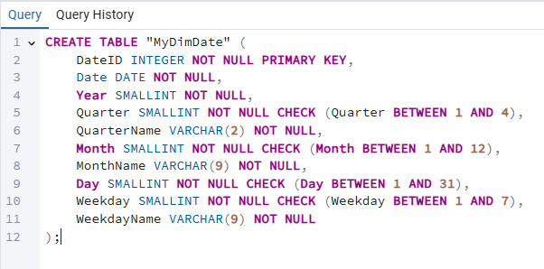  

## Task 6: Create the dimension table MyDimWaste  

Highlight all the text and delete it, and now run the following SQL string.

```sql
CREATE TABLE "MyDimWaste" (
    WasteID INTEGER NOT NULL PRIMARY KEY,
    WasteType VARCHAR(50) NOT NULL
);
```

  

Take a screenshot of the SQL statement and save it as `6-MyDimWaste.png`  

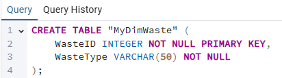  

## Task 7: Create the dimension table MyDimZone    

Highlight all the text and delete it, and now run the following SQL string.  

```SQL
CREATE TABLE "MyDimZone" (
    ZoneID INTEGER NOT NULL PRIMARY KEY,
    CollectionZone VARCHAR(50) NOT NULL,
    City VARCHAR(50) NOT NULL
);
```

  

Take a screenshot of the SQL statement and save it as `7-MyDimZone.png`  

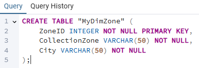  

## Task 8: Create the fact table MyFactTrips  

Highlight all the text and delete it, and now run the following SQL string.  

```SQL
CREATE TABLE "MyFactTrips" (
    TripID SERIAL PRIMARY KEY,
    DateID INTEGER NOT NULL,
    WasteID INTEGER NOT NULL,
    ZoneID INTEGER NOT NULL,
    WasteCollectedTons DECIMAL(10, 2) NOT NULL,
    FOREIGN KEY (DateID) REFERENCES "MyDimDate" (DateID),
    FOREIGN KEY (WasteID) REFERENCES "MyDimWaste" (WasteID),
    FOREIGN KEY (ZoneID) REFERENCES "MyDimZone" (ZoneID)
);
```

  

Take a screenshot of the SQL statement and save it as `8-MyFactTrips.png`  

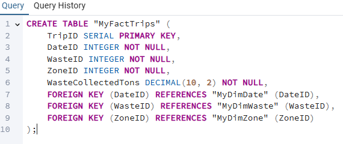  

<h1 align="center">Exercise 3: Load data into the data warehouse</h1>  

*After the initial schema design, you were told that due to operational issues, data could not be collected in the format initially planned. This implies that the previous tables (MyDimDate, MyDimWaste, MyDimZone, MyFactTrips) in the Project database and their associated attributes are no longer applicable to the current design. The company has now provided data in CSV files with new tables DimTruck and DimStation as per the new design.* 

*You will need to load the data provided by the company in CSV format. First, create a new database named `FinalProject`. Then, create the tables DimDate, DimTruck, DimStation, and FactTrips by defining the structure of the columns as per the CSV files. Next, load the data from the CSV files into the appropriate tables*.  

As we did in Task 5, right-click on `Databases > Create > Database` on the left tree-view.   


In the Database box, type `FinalProject` as the name for your new database, and then click Save. 


Now, click on the Query Tool and select Open File.  

  

To create the `DimDate` table, run the following SQL code. 

```SQL
CREATE TABLE "DimDate" (
    Dateid INTEGER NOT NULL PRIMARY KEY,
    Date DATE NOT NULL,
    Year SMALLINT NOT NULL,
    Quarter SMALLINT NOT NULL CHECK (Quarter BETWEEN 1 AND 4),
    QuarterName VARCHAR(2) NOT NULL,
    Month SMALLINT NOT NULL CHECK (Month BETWEEN 1 AND 12),
    MonthName VARCHAR(9) NOT NULL,
    Day SMALLINT NOT NULL CHECK (Day BETWEEN 1 AND 31),
    Weekday SMALLINT NOT NULL CHECK (Weekday BETWEEN 1 AND 7),
    WeekdayName VARCHAR(9) NOT NULL
);
```

For `DimStation`, run the following. 

```SQL
CREATE TABLE "DimStation" (
    Stationid INTEGER NOT NULL PRIMARY KEY,
    City VARCHAR(50) NOT NULL
);
```

The following creates `DimTruck`.

```SQL
CREATE TABLE "DimTruck" (
    Truckid INTEGER NOT NULL PRIMARY KEY,
    TruckType VARCHAR(50) NOT NULL
);
```

And finally, this last makes `FactTrips`.  

```SQL
CREATE TABLE "FactTrips" (
    Tripid INTEGER NOT NULL PRIMARY KEY,
    Dateid INTEGER NOT NULL,
    Stationid INTEGER NOT NULL,
    Truckid INTEGER NOT NULL,
    Wastecollected DECIMAL(10, 2) NOT NULL,
    FOREIGN KEY (Dateid) REFERENCES "DimDate" (Dateid),
    FOREIGN KEY (Stationid) REFERENCES "DimStation" (Stationid),
    FOREIGN KEY (Truckid) REFERENCES "DimTruck" (Truckid)
);
```

After running all these codes, right-click the `FinalProject` database and select the Refresh option from the dropdown. Once the database is refreshed, the 4 tables (`DimDate`, `DimStation`, `DimTruck`, `FactTrips`) are created under `Databases > Production > Schemas > public > Tables`. 

## Task 9: Load data into the dimension table DimDate  

In the tree-view, right-click on DimDate and go to Import/Export  

  

Click on the folder on the right side of `Filename`. 


Click on the upward pointing arrow on the upper left side of the window and select the following path: `/var/lib/pgadmin/`.  

  

Click on the three-dot icon on the upper right of the window.  

  

Drag and drop the file `DimDate.csv` and, once uploaded, click on the highlighted small `x` icon. 

  

Choose the `DimDate.csv` file on the screen and click the button `Select` on the lower-right corner of the window. 


Click on `Options`, select `Header`, and click on the lower-right button `OK`.  


Now the table is populated. 

Now run the following SQL query from the query tool.

```SQL
SELECT *
FROM "DimDate"
LIMIT 5;
```

Take a screenshot of the output and name it `9-DimDate.png`

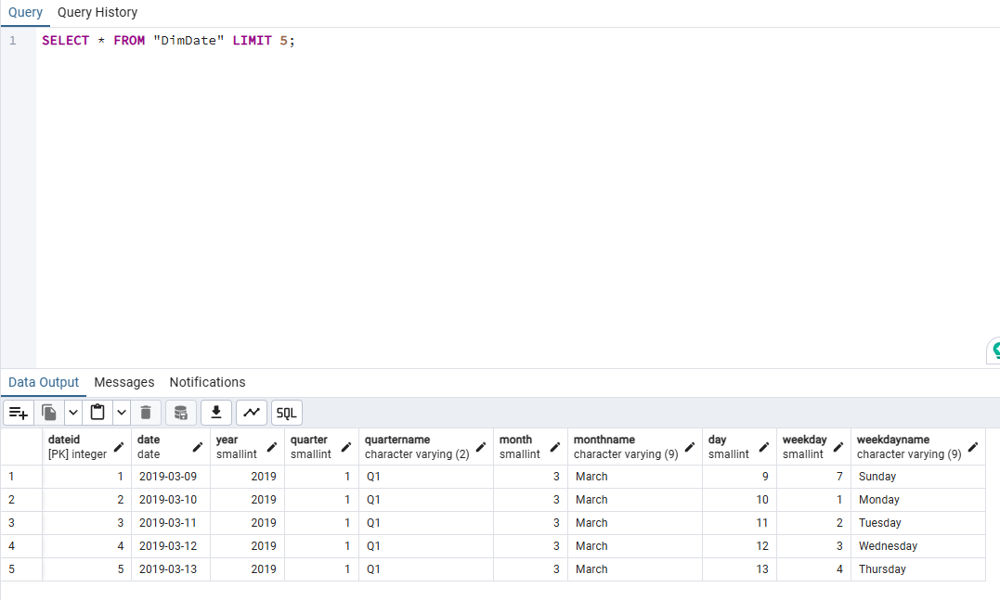

## Task 10: Load data into the dimension table DimTruck  

Repeat the same process with the table [DimTruck](./CSV/DimTruck.csv)  

Run the following SQL query.

```SQL
SELECT *
FROM "DimTruck"
LIMIT 5;

```
Take a screenshot of the output and name it `10-DimTruck.png`

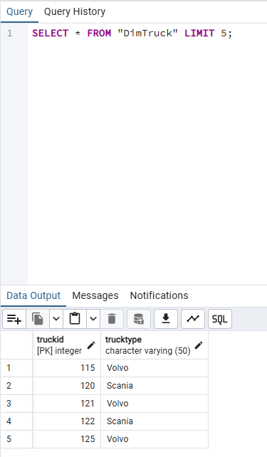  

## Task 11: Load data into the dimension table DimStation  

Repeat the same process with the table [DimStation](./CSV/DimStation.csv)  

Run the following SQL query.

```SQL
SELECT *
FROM "DimStation"
LIMIT 5;
```

Take a screenshot of the output and name it `11-DimStation.PNG`

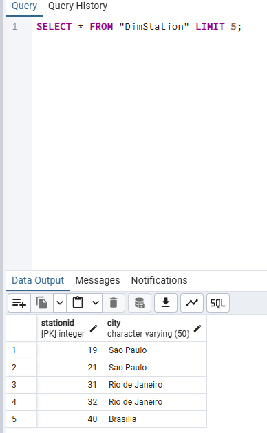

## Task 12: Load data into the fact table FactTrips  

Repeat the same process with the table [11-FactTrips](./CSV/FactTrips.csv)  

Run the following SQL query.

```SQL
SELECT *
FROM "FactTrips"
LIMIT 5;
```
Take a screenshot of the output and name it `12-FactTrips.png`.  

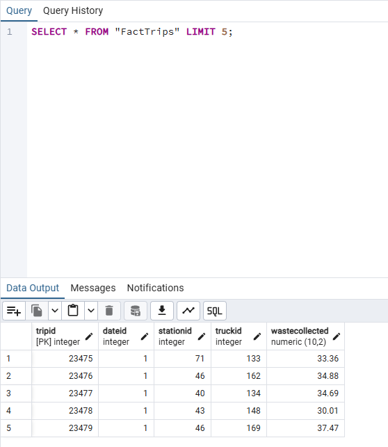  

<h1 align="center">Exercise 4 - Write aggregation queries and create materialized views</h1>  

## Task 13: Create a grouping sets query  

To create a grouping sets query using the columns stationid, trucktype, total waste collected, run the following SQL query. 

```SQL
SELECT FT.Stationid,
  DT.TruckType,
  SUM(FT.Wastecollected) AS TotalWasteCollected
FROM "FactTrips" FT
  JOIN "DimTruck" DT ON FT.Truckid = DT.Truckid
GROUP BY GROUPING SETS (FT.Stationid, DT.TruckType)
ORDER BY FT.Stationid, DT.TruckType;
```

Take a screenshot of the output and name it `13-groupingsets.png`.  

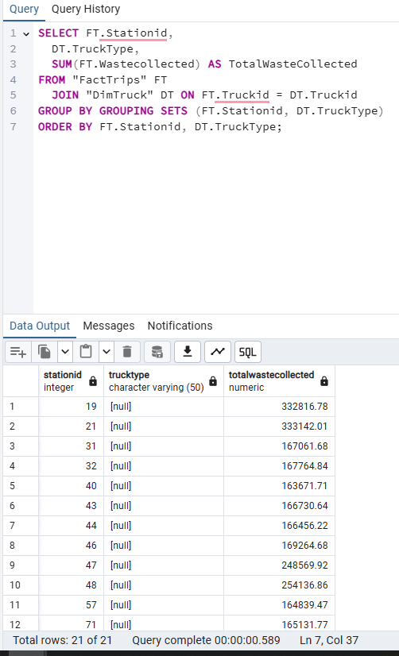  

## Task 14: Create a rollup query 

To create a rollup query using the columns year, city, stationid, and total waste collected, run the following SQL statement. 

```SQL
SELECT DD.Year,
  DS.City,
  FT.Stationid,
  SUM(FT.Wastecollected) AS TotalWasteCollected
FROM "FactTrips" FT
  JOIN "DimStation" DS ON FT.Stationid = DS.Stationid
  JOIN "DimDate" DD ON FT.Dateid = DD.Dateid
GROUP BY ROLLUP(DD.Year, DS.City, FT.Stationid)
ORDER BY DD.Year, DS.City, FT.Stationid;
```

Take a screenshot of the output and name it `14-rollup.png`.  

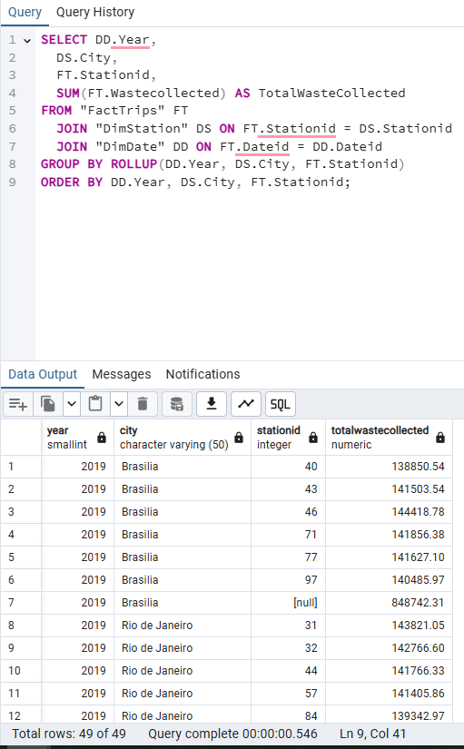  

## Task 15: Create a cube query  

To create a cube query using the columns year, city, stationid, and average waste collected, run the following SQL query. 

```SQL
SELECT DD.Year,
  DS.City,
  FT.Stationid,
  AVG(FT.Wastecollected) AS AverageWasteCollected
FROM "FactTrips" FT
  JOIN "DimStation" DS ON FT.Stationid = DS.Stationid
  JOIN "DimDate" DD ON FT.Dateid = DD.Dateid
GROUP BY CUBE(DD.Year, DS.City, FT.Stationid)
ORDER BY DD.Year, DS.City, FT.Stationid;
```

Take a screenshot of the output and name it `15-cube.png`.  

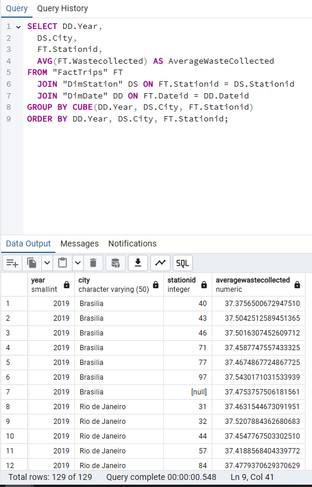  

## Task 16: Create a materialized view  

To ceate an materialised view named max_waste_stats using the columns city, stationid, trucktype, and max waste collected, run the following SQL statement. 

```SQL
CREATE MATERIALIZED VIEW max_waste_stats AS
SELECT DS.City,
  FT.Stationid,
	DT.TruckType,
	MAX(FT.Wastecollected) AS MaxWasteCollected
FROM "FactTrips" FT
  JOIN "DimStation" DS ON FT.Stationid = DS.Stationid
  JOIN "DimTruck" DT ON FT.Truckid = DT.Truckid
GROUP BY DS.City, FT.Stationid, DT.TruckType;
```

Take a screenshot of the output and name it `16-mv.png`.  

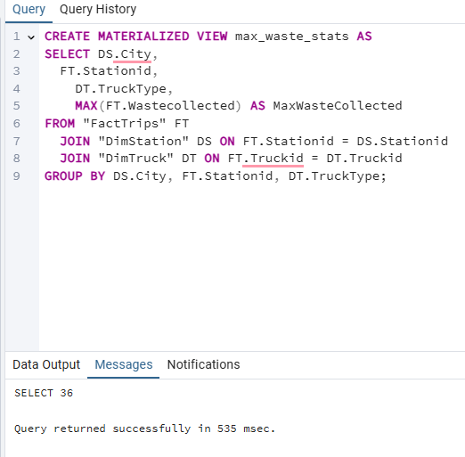  

Execute the SQL statement below to populate it. 

```SQL
REFRESH MATERIALIZED VIEW max_waste_stats;
```
